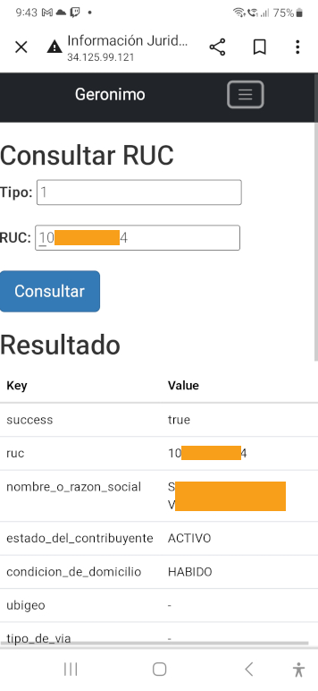

# GERONIMO APP

## OBJETIVO:

Crear el front-end para la aplicación geronimo para consulta de datos de
RUC y persona juridica.

## DESCRIPCIÓN:

La aplicación es responsive y funciona tanto en celular como en
navegador. Es una aplicación compacta y el campo fundamental es el de
RUC que debe ser ingresado correctamente, puede optener los datos de
persona jurídica de cualquier RUC. La vigencia es de 7 días mientras
esté habiliado el token generado en ruc.com.pe para esta prueba.

## PUBLICACIÓN:

La aplicación se encuentra publicada por 7 días en:

```
http://34.125.99.121/
```

## NOTA:

Se está haciendo uso de protocolo http debido que el GCP que estoy
usando es personal y lo uso sólo para prototipeos de aplicaciones y
pruebas de infrastructura y seguridad, los recursos son escasos pero
suficientes para esta mini aplicación.

## APLICACIONES RELACIONADAS:

- Juridica

```
https://github.com/nmagko/juridica
```

- Geronimo

```
https://github.com/nmagko/geronimo
```

## SCREENSHOT


