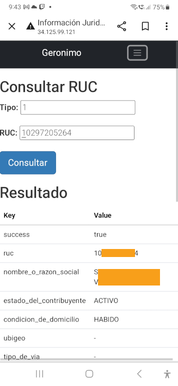

# GERONIMO APP

## GOAL

Create the front-end for the Geronimo app to query legal entity data.

## DESCRIPTION

The application is responsive and works on both cell phones and
browsers. It is a compact application. You can get the data of the legal
entity in Peru. The validity of the free token is seven days in
ruc.com.pe. You can create your own token for the same period of time.

## PUBLISHING

The application was published for seven days on:

```
http://34.125.99.121/
```

## NOTE

The HTTP protocol has been used because the GCP I am using using is
personal and I use it only for application prototyping and
infrastructure and security tests, resources are scarce but enough for
this tiny application.

## RELATED APPLICATIONS

- Juridica

```
https://github.com/nmagko/juridica
```

- Geronimo

```
https://github.com/nmagko/geronimo
```

## SCREENSHOT


